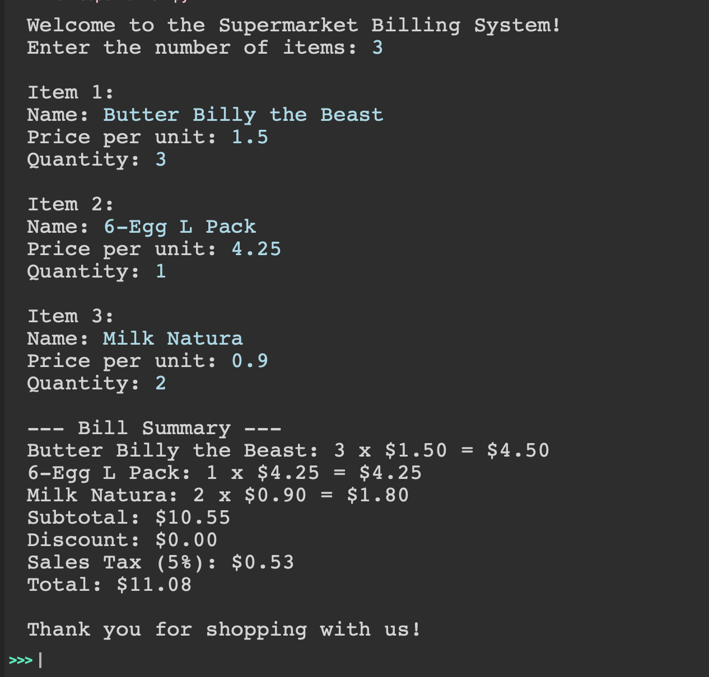

# python_Challenges

Create a command line program that simulates a basic billing system for a supermarket. The user can input items purchased (e.g., butter, eggs, etc), their prices, and quantities. The app will calculate the total bill, apply any applicable discounts, and display an itemized bill summary. This project focuses on loops, dictionaries, and arithmetic calculations.

